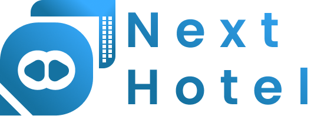
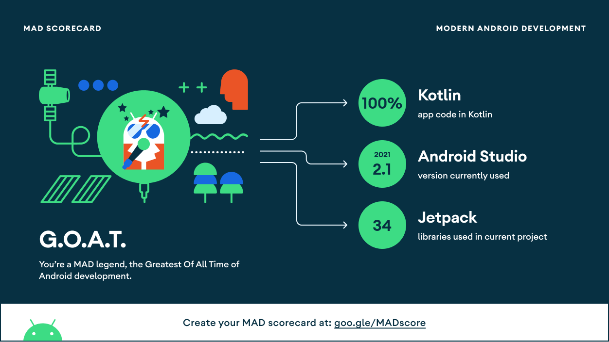
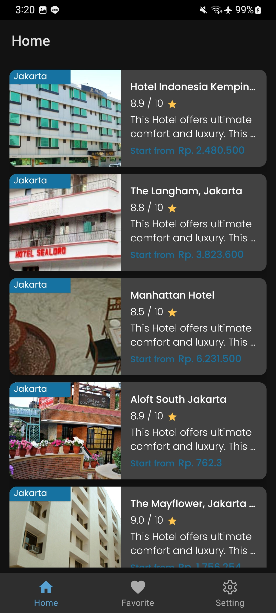
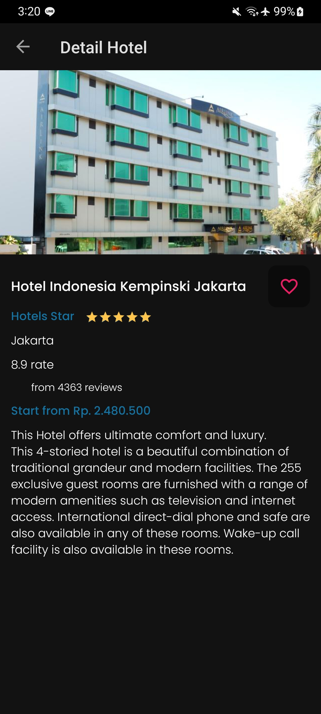
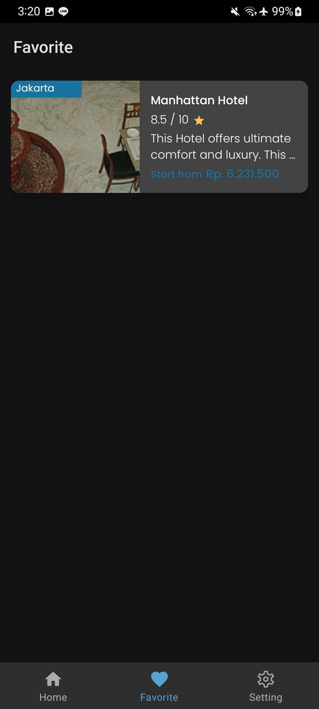
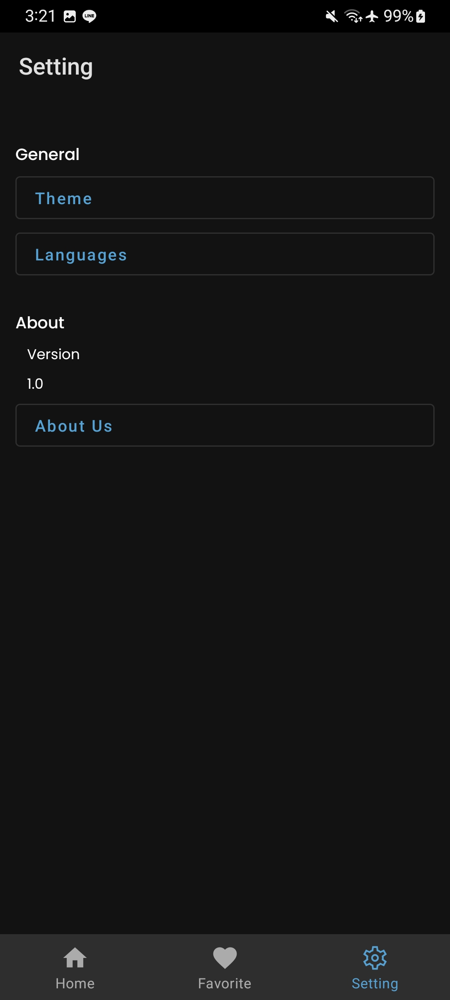
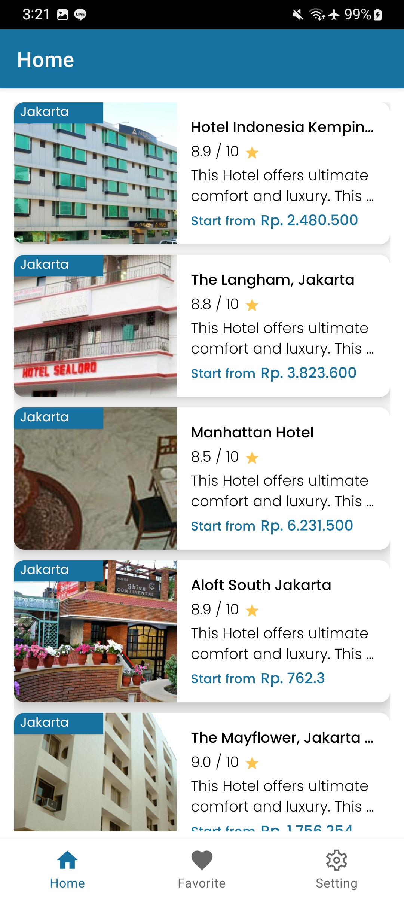

# **Next Hotel**

#### Take You To The Next Level

This repository is for Capstone Project in [Dicoding Academy](https://www.dicoding.com/academies/165). This application is purpose to help user to get hotel recommendations.  
 |

## Setup
Clone the repository on your machine. Open the project on your IDE and run it.

## About
- Explore Hotels
- Favorite Hotels
- Clean and Simple Material UI
- Light Mode and Dark Mode 🌗

## MAD Score

## 📸 Screenshots
||||
|:----------------------------------------:|:-----------------------------------------:|:-----------------------------------------: |
|  |  |  |
|  |  | 

## Built With 🛠
- Kotlin
    - Coroutines
- Android Jetpack
    - Flow
    - LiveData
    - ViewModel
    - Navigation UI
    - Room
- Koin
- SQLite
- SQLChiper
- Retrofit
- GSON Converter
- Coil
- Lottie
- Shimmer
- Leak Canary

## Architecture
This app uses Modularization with [Clean Architecture](https://blog.cleancoder.com/uncle-bob/2012/08/13/the-clean-architecture.html).

## Contact
Visit:
- [gonexwind git's](https://github.com/gonexwind)
